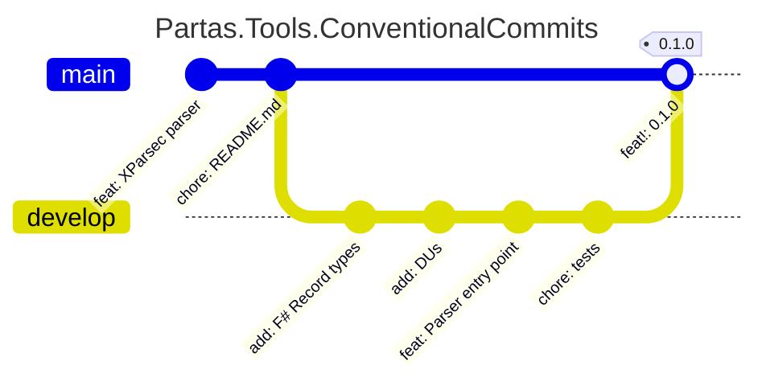

# Partas.Tools.ConventionalCommits




A parser for [Conventional Commit][Conventional Commit Spec] strings using [XParsec].

The parser [follows the Conventional Commit specs][Conventional Commit Spec].

> Since this uses XParsec, we expect Fable compatibility, this will be tested
> when Fable 5.0 is released, as I don't plan on supporting previous releases (an unfortunate side effect of all my current work being on Fable v5 alphas).

## Types

### ConventionalCommit

A conventional commit is a record of the following shape:

```fsharp
type ConventionalCommit = {
        Type: string
        Scope: string voption
        Subject: string // AKA Description
        Message: string voption
        Footers: Footer list
    }
```

### ParsedCommit

Parsed Commits are packaged in a Discriminated Union to identify failed parses, breaking changes, and conventional commits.

```fsharp
type ParsedCommit =
    | Unconventional of string
    | Conventional of ConventionalCommit
    | Breaking of ConventionalCommit
```

### Footer

Footers are also packaged in a discriminated union:

```fsharp
type Footer =
    | Footer of key: string * value: string
    | BreakingChange of value: string
```

You can use the helper property `Destructure` to ignore matching the union and unpacking a `string * string` tuple (in the case of a breaking change, a literal is used for the key - whether BREAKING-CHANGE or BREAKING CHANGE is used won't change the literal).

## Parsing

There are two flavors of the parser.

```fsharp
module ConventionalCommit =
    let parse (input: string): ParsedCommit
    let parseConventionalOrError (input: string): Result<ParsedCommit, string>
```

### parse

This is typical usage, and will return the `Unconventional` case with the string input when the commit message does not meet the spec.

### parseConventionalOrError

This is used for strict adherance, or to see why a commit message wasn't parsed.

The success case is guaranteed to be either the `Conventional` or `Breaking` cases of `ParsedCommit`. If the parser fails to make a conventional commit, then it will return the failure case with [XParsec] formatted error strings:

Example of error formatting:
```fsharp
"typscope): asdomfe"
|> parseConventionalOrError
|> Result.mapError (printfn "%A)
```
```ansi
"typscope): asdomf
        ^ At index 8 (Ln 1, Col 9)
Both parsers failed.
├───Expected '('
└───Both parsers failed.
    ├───Expected ':'
    └───Expected '!'"
```

## Spec

The parser meets the spec, but automatically lower cases case-insensitive proponents such as the `Type`, `Scope` and `Footer` keys.

[XParsec]: https://github.com/roboz0r/XParsec "GitHub XParsec"
[Conventional Commit Spec]: https://www.conventionalcommits.org/en/v1.0.0/#specification
