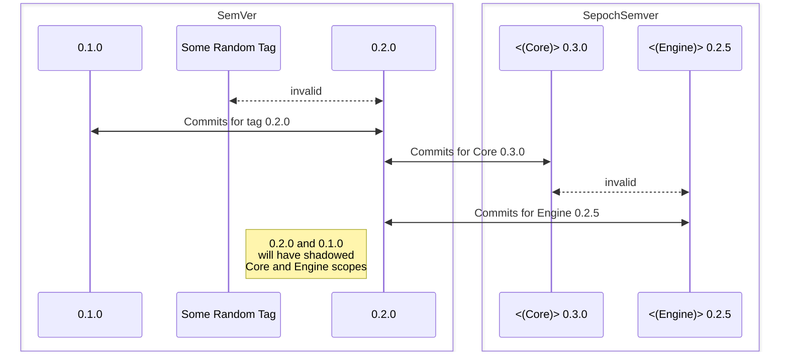

# GitNet

First purpose is automating `RELEASE_NOTES.md` generation with the flexibility I need for my mono repos like Partas.Solid.Primitives, and other wrappers which are piled into a singular repo.  I can then expand on this over time with more functionality.

## Requirements

- [x] Parse Commits
  - [x] Parse Conventional Commits
  - [x] Parse unconventional commits
  - [x] Collate critical information into a record
- [x] Find Projects
  - [x] Parse project source/compiled files
  - [x] SemVer based on changes to these items

## Spec

SemVer spec is used for parsing versions from tags, releases et al. With the following appended support for scoped tagging to indicate a release for a particular tree:

### Scoped Epoch

There is already some semblance of acceptance towards using either a 4th numerical or alphabetical sign to indicate an epoch.

I will begin by adding an extra qualifier for tags in a binding monorepo to disambiguate semvers of different bindings in tags.

```
// Where SCOPE is an optional alphabetical identifier bounded by ( parenthesis )
// Where EPOCH is an optional alphabetical character 
// Where the existence of either epoch or scope is bounded by < angle brackets >
// followed by 0 or more spaces
[<[EPOCH][(SCOPE)]>] [v][MAJOR].[MINOR].[PATCH][-PRERELEASE][+METADATA]
```

In this way parsing is not difficult. Major is determined by parsing the first numeric character.

### Repository Specs

Any git repository.

FSharp projects to use autoscoping features.

Project directories must be consistent. For this reason, a structured start with projects contained within a src directory
is suggested.

FSharp project files should not be removed.

All repository files are immediately contained within the working directory of the repository.

## Configuration

There are defaults that are used if no configuration is provided.

Most steps of the process can be configured by altering the config
record.

## Tags


SepochSemver tags are used for categorisation of commits. None-SepochSemver
compatible tags are ignored. This means a tag such as "wip-stash" or "init" 
will be ignored.

In the case that a non-semver tag would have been found between two semver
tags, the commits are categorised as if that tag did not separate them.

When utilising scopes, then all non-scoped tags are attributed to
all scopes. They therefor serve as bounds for commits within that scope.

In the scenario that there exists a scoped tag, then that tag only
serves as a boundary point for the commits of that scope.

In the scenario that there exists a scoped tag between two non scoped tags
for a scoped project, then the scoped tag continues to serve as a boundary.



### Collection

Collection is therefore to be interpreted as follows:

Collect all commits for a repository and distribute them into their scopes
along a chronological order.

Collect all tags and, the commits that fall between each, along
their chronological order.


All non-scoped tags are given 'illusory' scopes, such that each scope
has a matching tag.

The tag 'boundaries' that are unoccupied within a scope, are ignored.
The blocks that remain, will continue as delineated blocks until
the commits are resolved.

